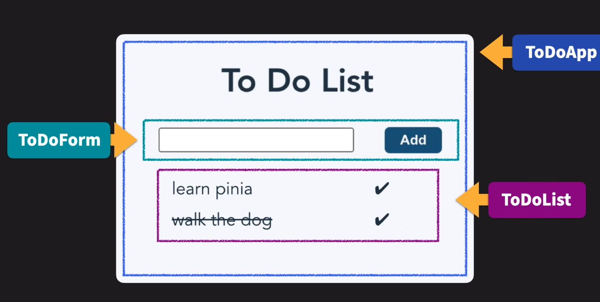

# Introduction à Pinia

## Qu'est ce que Pinia ?

Pinia c'est une bibliothèque de gestion d'état (states) pour Vue.js. Elle offre une alternative légère e performante à Vuex et constitue la nouvelle référence en tant que solution d'état officielle de Vue.js.
Contrairement à Vuex, Pinia est conçu en utilisant les capacités de réactivités de Vue.js, ce que la rend particulièrement adaptée aux applications Vue modernes.

Voici un aperçu de certains concepts en fonctionnalités clé de Pinia:

1. **Stores:**
    - Le coeur de Pinia réside dans les stores. Un store est un objet qui contient l'état de votre application (ou d'une partie) ainsi que les méthodes pour le modifier.
    - Chaque store est une instance de la classe `Store` de Pinia, ce qui lui permet de bénéficier de la réactivité de Vue.js
    - Vous pouvez créer différents stores pour différents domaines de votre application. Par exemple, un store pour les utilisateurs, un pour les produits...

2. **State:**
    - L'état d'un store est stocké dans sa propriété `state`. C'est là que vous définissez les données que vous souhaitez gérer de façon réactive.
    - Les states sont réactifs, ce qui signifie que toute modification de la state déclenchera automatiquement les mises à jour dans les composants qui y sont connectés.

3. **Actions:**
    - Les actions sont des méthodes définies dans un store qui permettent de modifier son état.
    - Contrairement aux mutations Vuex, les actions peuvent être asynchrones par défaut, simpliiant ainsi la gestion des opérations comme les appels API.

4. **Getters:**
    - Les getters sont des fonctions qui permettent d'accéder à des données dérivées de l'état du store. Ils sont utilisés pour calculer des valeurs dérivées de manière réactive.

5. **Plugins:**
    - Pinia prend en charge les plugins, qui peuvent étendre ses fonctionnalités de diverses manières.
    - Vous pouvez utiliser des plugins existants ou en créer de nouveaux pour répondre à des besoins spécifiques de votre application.

6. **Vue DevTools:**
    - Pinia est compatible avec les outils de développement de Vue.js, tels que Vue DevTools, ce qui facilite le débogage et l'inspection de l'état de vos stores pendant le développement.

## Pinia pour gérer le state (l'état)

Pinia est une solution destinée à faciliter la gester de l'état au sein de nos applications. Mais qu'entendons nous par "état" ?  
Dans le contexte d'une application, certaines informations restent statiques à l'écran, tandis que d'autres sont sujettes à des changements en fonction de diverses situations.

Prenons un exemple concret: dans une application, si un utilisateur n'est pas connecté, nous pourrions afficher un bouton "Se Connecter". En revanche, si cet utilisateur est déjà connecté, il serait plus judicieux de masquer ce bouton. Ainsi, la visibilité de ce bouton dépend entièrement d'un state: l'état de connexion de l'utilisateur.

Maintenant que nous avons saisi la notion d'état, une question se pose: comment gérons-nous cet état au sein d'une application Vue, qui regorge de composants ? Techniquement, il serait possible de stocker les états locaux au sein de chaque composant à l'aide d'une propriété de données ou d'une référence réactive. Cependant, que faire lorsqu'un composant doit communiquer un état à un autre composant, situé dans une partie totalement distincte de la hiérarchie des composants ?

Nous pourrions émettre des événements vers le haut de la hiérarchie (emits), puis utiliser des propriétés pour transmettre cet état vers le bas (props). Toutefois, cette approche pourrait rapidement devenir complexe et difficile à maintenir. 
Ne serait-il pas plus pratique d'avoir un état global, une sorte de source unique pour l'état de notre application, accessible à tous les composants peu importe leur position dans l'arborescence ?

Et si cet état global était réactif ? Ainsi, tout changement d'état serait automatiquement pris en compte par tous les composants qui en dépendent, simplifiant ainsi la gestion de notre application.

C'est précisément ce que Pinia nous offre.

## Construction d'un store

Un composant Vue.js est principalement composé de trois choses: **de la data** (qu'on utilise avec nos ref() en CompositionAPI), **des méthodes** pour modifier cette data, et des **computed** qui vont utiliser de la data pour nous retourner des résultats sans affecter la data elle-même.

Un store de Pinia fonctionne de la même façon, la partie **state** gère la data en tant que telle, les **actions** jouent le rôle de méthodes qui viennent update notre state et enfin, les **getters** viennent utiliser notre state pour en retourner une version traité (computed).

# Construire un store simple (Todo)

Pour étudier la mécanique des Stores, nous allons utiliser l'un des projets les plus simples: la ToDoList.

Partons d'un projet classique Vue.js mais indiquons que nous souhaitons intégrer des stores Pinia

```
npm create vue@latest
```

Nous pouvons supprimer les trois components par défaut et les remplacer par les notres : ToDoApp, ToDoForm, ToDoList

La première étape est donc de mettre notre ToDoForm et notre ToDoList dans le template de notre ToDoApp puis de mettre ce même ToDoApp dans notre App.vue (on en profite pour supprimer l'ancien template et le CSS). C'est également le moment de créer notre premier store todoList.js à l'intérieur du dossier stores.



## Construction du fichier todoList.js

Première étape, l'import et l'export.

Puis, on ajoute le state et les actions. Nous savons que la logique principale à faire en premier sera d'jaouter un élément à la liste de tâches. Nous allons écrire une fonction addTodo qui effectuera la logique d'ajout d'un objet dans le tableau todoList.

Les actions individuelles sont des méthodes situées dans l'objet actions du store.
Nous avons ajouté également une propriété id à l'état car nous voulons que chaque élément ait un identifiant qui s'incrémente à chaque fois qu'un nouvel élément est ajouté dans le tableau todoList.

```js
// src/store/todoList.js

import { defineStore } from "pinia";

export const useTodoListStore = defineStore("todoList", {
state: () => ({
todoList: [],
id: 0,
}),
    actions: {
        addTodo(item) {
            this.todoList.push({ item, id: this.id++, completed : false})
        },
        deleteTodo(itemId) {
            this.todoList = this.todoList.filter((x) => {
                return x.id !== itemId
            } )
        }
    }
});
```

### Insérer le formulaire dans le template avec v-model et appel du store

```js
import { useTodoListStore } from '@/stores/todoList';

const todo = ref('');

const store = useTodoListStore();

function addItem(item) {
    if (item.length === 0) {
        return
    }
    store.addTodo(item);
    todo.value = '';
}
```

A cette étape, on peut vérifier avec Vue DevTools.

## Récupérer le state dans le composant ToDoList

Dans la leçon précédente, nous avons utilisé une action du store Pinia (addToDo) dans notre composant toDoForm.vue

Dans cette leçon, nous utiliserons une propriété d'état dans le composant toDoList.vue et il faut qu'elle soit réactive aux changements qui pourrait survenir. Nous allons l'utiliser à l'intérieur du template, et elle doit être réactive afin de se mettre à jour en synchronisation avec les changements de state.

Pinia nous fournit une fonction importante : **storeToRefs**

### storeToRefs

Chaque élément de la liste de tâches affiché dans le composant todoList viendra donc du Store, et étant donné que le state dans le store est un objet, il nous faut utiliser cette méthode auxiliaire pour déstructurer l'objet retourné sans perdre la réactivité. C'est similaire à la fonction utilitaire `toRefs` de Vue3.

### Afficher la ToDoList

Nous voulons accéder à la todoList qui se trouve dans la store (qui contient maintenant des données pour représenter les éléments que nous avons ajoutés à la liste). Nous avons donc importé notre store, et définie sa constante store.
Ensuite nous avons enveloppé la propriété todoList que nous voulons extraire dans la fonction storeToRefs.

Maintenant, nous pouvons utiliser todoList dans notre modèle, et il restera synchronisé avec le store. Il suffit d'utiliser la directive `v-for`

```js
<template>
  <div v-for="todo in todoList" :key="todo.id">
    <div>{{ todo.item }}</div>
  </div>
</template>
```

La liste s'affiche enfin.

## Compléter des todos

Nous voulons ajouter du style à chaque élément pour montrer si l'élément de la liste de tâches a été complété.

Tout d'abord, nous avons besoin de la logique pour basculer un élément effectué ou non. Pour l'instant, dans le store, chaque élément ajouté à la liste a également une propriété "completed" définie sur false.
Nous pouvons écrire une action dans le store pour basculer cette valeur à true.

```js
toggleCompleted(idToFind) {
   const todo = this.todoList.find((obj) => obj.id === idToFind);
   if (todo) {
     todo.completed = !todo.completed;
   }
 },
```

Dans le composant todoList.vue, nous allons ajouter un emoji en Unicode(`&#10004;`) en tant que span dans le modèle avec un écouteur d'évènement sur un clic.
Cependant, nous devons nous assurer d'avoir inclus toggleCompleted dans le composant. Etant donné qu'il s'agit d'une méthode d'action et non d'un state réactif, nous n'avons pas besoin d'utiliser le storeToRefs.

## Ajouter la suppression

Nous avions déjà ajouté la fonction `deleteTodo` au store, donc nous pouvons passer à l'écriture de la fonction de suppression à l'intérieur du composant.

Nous ferons la même chose que dans la section précédente, en ajoutant l'action `deleteTodo` du magasin et en utilisant un emoji de croix pour le bouton de suppression.
